# Especificação Técnica

Este documento detalha as decisões técnicas, arquitetura do sistema e padrões de design adotados no desenvolvimento deste projeto.

## 1. Introdução

Esta especificação técnica descreve a arquitetura e as decisões de design para o projeto **Vigenda**. Vigenda é uma aplicação de linha de comando (CLI) construída em Go, com uma Interface de Texto do Usuário (TUI), destinada a auxiliar estudantes no gerenciamento de suas atividades acadêmicas. Os objetivos técnicos incluem fornecer uma ferramenta responsiva, fácil de usar localmente e com persistência de dados confiável.

## 2. Arquitetura do Sistema

Vigenda adota uma arquitetura em camadas, comum em aplicações CLI e de servidor, para separar as preocupações e facilitar a manutenção e testabilidade.

### 2.1. Visão Geral da Arquitetura

A arquitetura pode ser descrita como uma aplicação monolítica com camadas bem definidas:

1.  **Camada de Apresentação (TUI):** Responsável pela interação com o usuário.
2.  **Camada de Comando (CLI):** Responsável por interpretar os comandos da linha de comando (usando Cobra).
3.  **Camada de Serviço (Lógica de Negócios):** Orquestra as operações e contém a lógica de negócios principal.
4.  **Camada de Repositório (Acesso a Dados):** Abstrai a interação com o banco de dados.
5.  **Camada de Domínio (Modelos):** Define as estruturas de dados centrais.
6.  **Camada de Infraestrutura (Banco de Dados, Configuração):** Componentes de suporte.

### 2.2. Componentes Principais (Pacotes Go)

A estrutura do projeto reflete essas camadas através dos seguintes pacotes principais dentro de `internal/` e `cmd/`:

-   **`cmd/vigenda`**:
    -   **Responsabilidade:** Ponto de entrada da aplicação. Inicializa os comandos CLI usando o framework `spf13/cobra`, configura a aplicação e delega a execução para os manipuladores de comando apropriados que, por sua vez, interagem com a camada de TUI e/ou Serviço.
    -   **Tecnologias:** Go, `spf13/cobra`.

-   **`internal/tui`**:
    -   **Responsabilidade:** Implementa a Interface de Texto do Usuário. Utiliza as bibliotecas `charmbracelet/bubbletea`, `charmbracelet/bubbles`, e `charmbracelet/lipgloss` para criar componentes interativos como tabelas, prompts, e status bars. Recebe dados da camada de serviço e os apresenta ao usuário, além de capturar entradas do usuário para a camada de serviço.
    -   **Tecnologias:** Go, `charmbracelet/bubbletea`, `charmbracelet/bubbles`, `charmbracelet/lipgloss`.

-   **`internal/service`**:
    -   **Responsabilidade:** Contém a lógica de negócios principal da aplicação. Coordena as interações entre a camada de apresentação/comando e a camada de repositório. Valida dados de entrada, executa cálculos e toma decisões com base nas regras de negócio. Por exemplo, o `TaskService` lida com a criação, atualização e listagem de tarefas.
    -   **Tecnologias:** Go.

-   **`internal/repository`**:
    -   **Responsabilidade:** Abstrai o acesso aos dados. Define interfaces para operações de persistência (CRUD - Create, Read, Update, Delete) e fornece implementações concretas que interagem com o banco de dados. Isso permite trocar a implementação do banco de dados com impacto mínimo no resto da aplicação.
    -   **Tecnologias:** Go, `mattn/go-sqlite3`.

-   **`internal/models`**:
    -   **Responsabilidade:** Define as estruturas de dados (structs Go) que representam as entidades centrais do domínio, como `Task`, `Class`, `Subject`, `Assessment`, `Question`. Essas estruturas são usadas em todas as camadas da aplicação.
    -   **Tecnologias:** Go.

-   **`internal/database`**:
    -   **Responsabilidade:** Gerencia a conexão com o banco de dados SQLite e executa migrações de esquema. O arquivo `migrations/001_initial_schema.sql` define a estrutura inicial do banco de dados.
    -   **Tecnologias:** Go, `mattn/go-sqlite3`.

-   **`internal/config`**:
    -   **Responsabilidade:** Carrega e gerencia as configurações da aplicação. Isso pode incluir caminhos de arquivo, configurações de banco de dados (embora atualmente o caminho do DB pareça fixo ou derivado), ou outras preferências do usuário.
    -   **Tecnologias:** Go.

#### 2.2.1. Detalhamento dos Módulos Internos (`internal/`)

##### `internal/config` (`config.go`)
-   **Responsabilidade Principal:** Carregar e fornecer acesso a configurações da aplicação. Atualmente, parece lidar principalmente com a determinação do caminho do banco de dados e o nome do arquivo de log.
-   **Principais Funções/Structs:**
    -   `LoadConfig()`: (Inferido) Função que carrega as configurações.
    -   `GetDBPath()`: (Inferido) Retorna o caminho para o arquivo de banco de dados SQLite.
    -   `GetLogPath()`: (Inferido) Retorna o caminho para o arquivo de log.
-   **Interações:** Usado principalmente pela camada `database` para saber onde encontrar/criar o banco de dados e potencialmente por outras partes da aplicação que precisam de caminhos configurados.

##### `internal/database` (`database.go`, `connection.go`, `migrations/`)
-   **Responsabilidade Principal:** Gerenciar a conexão com o banco de dados SQLite, incluindo a inicialização da conexão e a aplicação de migrações de esquema.
-   **Principais Funções/Structs:**
    -   `InitDB(dbPath string)` ou `GetDBConnection()`: (Inferido) Estabelece e retorna uma conexão (`*sql.DB`) com o banco de dados SQLite.
    -   Lógica para executar migrações SQL a partir do diretório `migrations/` na primeira inicialização ou quando necessário.
-   **Interações:** Fornece a conexão `*sql.DB` para a camada `repository` para que ela possa executar operações CRUD. Interage com `internal/config` para obter o caminho do banco de dados.

##### `internal/models` (`models.go`)
-   **Responsabilidade Principal:** Definir as estruturas de dados (structs Go) que representam as entidades centrais do domínio da aplicação. Essas structs são usadas em todas as outras camadas.
-   **Principais Funções/Structs:**
    -   `User`, `Subject`, `Class`, `Student`, `Lesson`, `Assessment`, `Grade`, `Task`, `Question`. Cada struct define os campos correspondentes às colunas da tabela do banco de dados.
-   **Interações:** Usado extensivamente pelas camadas `service` e `repository` para transferir dados e pela camada `tui` para exibir informações.

##### `internal/repository` (ex: `task_repository.go`, `subject_repository.go`, etc.)
-   **Responsabilidade Principal:** Implementar a lógica de acesso a dados (Data Access Logic). Abstrai as operações de banco de dados (CRUD - Create, Read, Update, Delete) para as entidades de domínio. Cada tipo de entidade geralmente tem seu próprio arquivo de repositório (ex: `TaskRepository` para `Task`).
-   **Principais Funções/Structs:**
    -   Interfaces (ex: `TaskRepositoryInterface`) definindo os métodos CRUD (ex: `CreateTask`, `GetTaskByID`, `GetAllTasks`, `UpdateTask`, `DeleteTask`).
    -   Structs de implementação (ex: `taskSQLRepository`) que implementam essas interfaces e contêm um `*sql.DB` para interagir com o banco de dados.
    -   Métodos que constroem e executam consultas SQL (SELECT, INSERT, UPDATE, DELETE) usando a conexão do banco de dados.
-   **Interações:** Recebe chamadas da camada `service` e interage com `internal/database` (ou diretamente com `*sql.DB` fornecido por ele) e `internal/models`.

##### `internal/service` (ex: `task_service.go`, `class_service.go`, etc.)
-   **Responsabilidade Principal:** Conter a lógica de negócios da aplicação. Orquestra o fluxo de dados entre a camada de apresentação (TUI/CLI) e a camada de repositório. Valida dados de entrada, executa cálculos, toma decisões com base nas regras de negócio e formata dados para apresentação.
-   **Principais Funções/Structs:**
    -   Structs de serviço (ex: `TaskService`) que geralmente dependem de interfaces de repositório (injetadas via construtor para testabilidade).
    -   Métodos públicos que expõem as funcionalidades de negócios (ex: `CreateNewTask`, `ListTasksForUser`, `CompleteTask`).
-   **Interações:** Chamado pela camada `cmd/vigenda` (comandos Cobra) ou `internal/tui`. Interage com a camada `repository` para buscar ou persistir dados e com `internal/models` para manipular os dados do domínio.

##### `internal/tui` (`tui.go`, `prompt.go`, `table.go`, `statusbar.go`, etc.)
-   **Responsabilidade Principal:** Implementar todos os aspectos da Interface de Texto do Usuário (TUI) usando `charmbracelet/bubbletea`. Isso inclui a definição de modelos (`bubbletea.Model`), a lógica de atualização (`Update` func), a renderização da visualização (`View` func) e o manuseio de mensagens (`tea.Msg`).
-   **Principais Funções/Structs:**
    -   Modelos Bubbletea para diferentes telas ou componentes da TUI (ex: um modelo para a visualização de tarefas, um modelo para o formulário de adição de disciplina).
    -   Funções `Update` que lidam com eventos do usuário (teclado, mouse) e outras mensagens.
    -   Funções `View` que renderizam o estado atual do modelo como string para exibição no terminal, usando `lipgloss` para estilização.
    -   Componentes reutilizáveis (como os de `prompt.go`, `table.go`) que encapsulam partes da UI.
-   **Interações:** Interage com a camada `service` para buscar dados a serem exibidos ou para enviar dados inseridos pelo usuário para processamento. É orquestrada pelos comandos CLI em `cmd/vigenda`.

### 2.3. Fluxo de Dados e Diagrama de Camadas (Exemplo: Adicionar uma Tarefa)

A seguir, um exemplo de fluxo de dados para a funcionalidade de adicionar uma nova tarefa, ilustrando a interação entre as camadas.

**Diagrama Textual de Camadas e Fluxo:**

```mermaid
graph LR
    Usuario --> A[CLI (cmd/vigenda - Cobra)];
    A -- Comando 'tarefa adicionar' --> B(TUI (internal/tui - Bubbletea));
    B -- Dados da Tarefa --> C(Service (internal/service - TaskService));
    C -- Valida e Processa --> D(Repository (internal/repository - TaskRepository));
    D -- Operação CRUD --> E(Database (internal/database - SQLite));
    E -- Resultado --> D;
    D -- Resultado --> C;
    C -- Resultado/Modelo Atualizado --> B;
    B -- Exibe Confirmação/Erro --> Usuario;
```

**Passos Detalhados do Fluxo:**

1.  **Usuário (Linha de Comando):** O usuário digita um comando na CLI, por exemplo, `vigenda tarefa adicionar` ou interage com um prompt da TUI para adicionar uma tarefa.
2.  **CLI (`cmd/vigenda`):**
    -   O framework `cobra` parseia o comando e seus argumentos/flags.
    -   O manipulador do comando `adicionar tarefa` é invocado.
3.  **TUI (`internal/tui`):**
    -   Se a adição for interativa, a TUI apresenta um formulário (ex: um `bubble.Model` com `textinput.Model` para o nome da tarefa, descrição, etc.).
    -   A TUI coleta os dados inseridos pelo usuário.
    -   Ao submeter o formulário, a TUI envia os dados para a camada de Serviço.
4.  **Service (`internal/service.TaskService`):**
    -   O método `CreateTask` (ou similar) é chamado com os dados da nova tarefa.
    -   Realiza validações de negócios (ex: nome da tarefa não pode ser vazio, data de vencimento válida).
    -   Cria uma struct `models.Task` com os dados validados.
    -   Chama o método apropriado na camada de Repositório (ex: `TaskRepository.Create(task)`).
5.  **Repository (`internal/repository.TaskRepository`):**
    -   Recebe o objeto `models.Task` do serviço.
    -   Constrói e executa a instrução SQL `INSERT` no banco de dados SQLite.
    -   Lida com a conexão ao banco de dados através de `internal/database`.
    -   Retorna a tarefa criada (possivelmente com o ID preenchido pelo banco de dados) ou um erro.
6.  **Database (`internal/database` e SQLite):**
    -   Executa a transação SQL.
    -   Persiste os dados da nova tarefa.
7.  **Retorno do Fluxo:**
    -   O Repositório retorna o resultado para o Serviço.
    -   O Serviço processa o resultado (ex: loga um erro) e o retorna para a TUI/CLI.
    -   A TUI/CLI exibe uma mensagem de sucesso ou erro para o usuário. Se for a TUI, ela pode atualizar sua visualização para incluir a nova tarefa.

Este fluxo demonstra a separação de responsabilidades: a TUI/CLI lida com a interação do usuário, o Serviço com a lógica de negócios, e o Repositório com a persistência de dados.

### 2.4. Outros Fluxos de Dados Importantes (Diagramas Textuais)

#### a. Listar Tarefas de uma Disciplina (via TUI)

**Nota sobre Diagramas Mermaid:** Para visualizar corretamente os diagramas `graph LR ...` abaixo, copie o bloco de código correspondente e cole-o em um renderizador Mermaid online (ex: [Mermaid Live Editor](https://mermaid.live/)) ou use uma extensão apropriada em seu editor de Markdown.

```mermaid
graph LR
    Usuario --> TUI_List[TUI: Seleciona Disciplina e Opção Listar Tarefas];
    TUI_List -- SubjectID --> Serv_GetClasses[Service: ClassService.GetClassesBySubjectID];
    Serv_GetClasses -- SubjectID --> Repo_GetClasses[Repository: ClassRepository.FindBySubjectID];
    Repo_GetClasses -- Consulta SQL (SELECT * FROM classes WHERE subject_id = ?) --> DB_Classes[Database: SQLite];
    DB_Classes -- Lista de models.Class --> Repo_GetClasses;
    Repo_GetClasses -- Lista de models.Class --> Serv_GetClasses;
    Serv_GetClasses -- Lista de ClassIDs --> Serv_ListTasks[Service: TaskService.ListTasksByClassIDs];
    Serv_ListTasks -- Lista de ClassIDs --> Repo_ListTasks[Repository: TaskRepository.FindByClassIDs];
    Repo_ListTasks -- Consulta SQL (SELECT * FROM tasks WHERE class_id IN (...)) --> DB_Tasks[Database: SQLite];
    DB_Tasks -- Lista de models.Task --> Repo_ListTasks;
    Repo_ListTasks -- Lista de models.Task --> Serv_ListTasks;
    Serv_ListTasks -- Lista de Tarefas Formatada --> TUI_List;
    TUI_List -- Exibe Tabela de Tarefas --> Usuario;
```



**Passos Detalhados:**
1.  **Usuário (TUI):** O usuário navega na TUI, seleciona uma disciplina específica e escolhe a opção para listar as tarefas associadas a essa disciplina.
2.  **TUI (`internal/tui`):** A TUI captura o ID da disciplina selecionada.
3.  **Chamada ao Serviço de Turmas:** A TUI (ou um coordenador na camada de aplicação) chama `ClassService.GetClassesBySubjectID(subjectID)` para obter todas as turmas pertencentes à disciplina.
4.  **Repositório de Turmas (`internal/repository.ClassRepository`):** O `ClassService` delega a chamada para `ClassRepository.FindBySubjectID(subjectID)`.
5.  **Consulta ao Banco (Turmas):** O `ClassRepository` executa uma consulta SQL (ex: `SELECT id, name FROM classes WHERE subject_id = ?`) para buscar as turmas.
6.  **Retorno das Turmas:** O banco de dados retorna a lista de turmas (`[]models.Class`). O repositório mapeia os resultados e os retorna ao `ClassService`.
7.  **Chamada ao Serviço de Tarefas:** O `ClassService` (ou o coordenador da TUI) extrai os IDs das turmas (`ClassIDs`) e chama `TaskService.ListTasksByClassIDs(classIDs)`.
8.  **Repositório de Tarefas (`internal/repository.TaskRepository`):** O `TaskService` delega para `TaskRepository.FindByClassIDs(classIDs)`.
9.  **Consulta ao Banco (Tarefas):** O `TaskRepository` executa uma consulta SQL (ex: `SELECT * FROM tasks WHERE class_id IN (?, ?, ...)`), usando os IDs das turmas obtidos.
10. **Retorno das Tarefas:** O banco de dados retorna a lista de tarefas (`[]models.Task`) associadas a essas turmas. O repositório mapeia e retorna ao `TaskService`.
11. **Formatação e Exibição:** O `TaskService` (ou a TUI diretamente) formata os dados das tarefas.
12. **TUI (`internal/tui`):** A TUI renderiza uma tabela ou lista com as tarefas para o usuário.

Este fluxo mais preciso reflete que as tarefas são diretamente associadas a `classes` (turmas), e as turmas são associadas a `subjects` (disciplinas), conforme o `DATABASE_SCHEMA.md`.

#### b. Iniciar Sessão de Foco para uma Tarefa (via CLI)

```mermaid
graph LR
    Usuario -- Comando 'foco iniciar --tarefaID X' --> CLI_Focus[CLI: Cobra Command];
    CLI_Focus -- TarefaID, Duração --> Serv_Focus[Service: FocusService.StartFocusSession];
    Serv_Focus -- Valida TarefaID --> Repo_TaskFocus[Repository: TaskRepository.GetByID];
    Repo_TaskFocus -- Consulta SQL --> DB_FocusTask[Database: SQLite];
    DB_FocusTask -- Dados da Tarefa --> Repo_TaskFocus;
    Repo_TaskFocus -- model.Task --> Serv_Focus;
    Serv_Focus -- Cria FocusBlock/StudySession --> Repo_Focus[Repository: FocusRepository.CreateSession];
    Repo_Focus -- INSERT SQL --> DB_FocusSession[Database: SQLite];
    DB_FocusSession -- Confirmação --> Repo_Focus;
    Repo_Focus -- Confirmação --> Serv_Focus;
    Serv_Focus -- Inicia Timer TUI --> TUI_Focus[TUI: Focus Timer Display];
    TUI_Focus -- Atualizações de Tempo --> Usuario;
    Serv_Focus -- Ao Concluir/Interromper --> Repo_FocusUpdate[Repository: FocusRepository.UpdateSession];
    Repo_FocusUpdate -- UPDATE SQL --> DB_FocusSession;
```

**Passos:**
1.  Usuário executa `vigenda foco iniciar --tarefaID <ID> --duracao <tempo>`.
2.  O comando Cobra (`cmd/vigenda`) parseia os argumentos e chama `FocusService.StartFocusSession`.
3.  `FocusService` primeiro busca a tarefa pelo ID usando `TaskRepository` para garantir que ela existe.
4.  Se a tarefa existe, `FocusService` cria um novo registro de `FocusBlock` ou `StudySession` (dependendo do modelo exato) e o salva usando um `FocusRepository` (ou `StudySessionRepository`).
5.  O `FocusRepository` insere os dados no banco de dados.
6.  `FocusService` então inicia a lógica do temporizador e atualiza a TUI (`internal/tui`) para exibir o contador regressivo.
7.  Quando a sessão de foco termina (ou é interrompida), `FocusService` atualiza o registro da sessão no banco de dados (ex: marcando como concluída, registrando a duração efetiva).

## 3. Escolhas Tecnológicas

### 3.1. Linguagens de Programação

-   **Go (Golang):** Versão 1.23.0 (toolchain go1.24.3).
    -   **Justificativa:** Go é escolhido por sua simplicidade, desempenho, forte tipagem estática, excelente suporte à concorrência (embora não seja o foco principal aqui, é uma vantagem da linguagem) e capacidade de compilar para binários únicos e independentes, ideal para aplicações CLI. Seu ecossistema para CLIs e TUIs (como Cobra e Bubbletea) é robusto.

-   **SQL:** Usado para definir o esquema do banco de dados e para interações com o banco de dados.

### 3.2. Frameworks e Bibliotecas Principais

-   **`spf13/cobra`:** Framework para criar aplicações CLI poderosas e modernas.
    -   **Justificativa:** Facilita a criação de subcomandos, gerenciamento de flags e geração automática de documentação de ajuda.
-   **`charmbracelet/bubbletea`:** Framework para construir Interfaces de Texto do Usuário (TUIs) baseadas no padrão The Elm Architecture.
    -   **Justificativa:** Permite criar interfaces interativas e ricas no terminal de forma declarativa e gerenciável.
-   **`charmbracelet/bubbles`:** Coleção de componentes prontos para uso com `bubbletea` (listas, spinners, inputs de texto, etc.).
    -   **Justificativa:** Acelera o desenvolvimento da TUI.
-   **`charmbracelet/lipgloss`:** Biblioteca para estilização de texto no terminal (cores, bordas, margens).
    -   **Justificativa:** Permite criar uma TUI visualmente agradável.
-   **`mattn/go-sqlite3`:** Driver Go para SQLite.
    -   **Justificativa:** SQLite é um banco de dados leve, baseado em arquivo, ideal para aplicações locais que não requerem um servidor de banco de dados separado. É fácil de embutir e configurar.
-   **`stretchr/testify`:** Toolkit para testes em Go, especialmente `assert` e `require` para asserções mais fluentes e `mock` para criar dublês de teste.
    -   **Justificativa:** Melhora a legibilidade e a escrita de testes unitários.

### 3.3. Banco de Dados

-   **SQLite:** Banco de dados SQL embutido, baseado em arquivo.
    -   **Justificativa:** Simplicidade, portabilidade (o banco de dados é um único arquivo), e adequação para uma aplicação CLI de uso local/pessoal. Não requer um processo de servidor de banco de dados separado. O esquema é gerenciado via arquivos SQL em `internal/database/migrations/`.

### 3.4. Infraestrutura e Implantação (DevOps)

-   **Plataforma de Hospedagem:** Sendo uma aplicação CLI local, não há uma "plataforma de hospedagem" tradicional. Os binários são distribuídos para serem executados nas máquinas dos usuários (Linux, Windows, conforme `build.sh`).
-   **Conteinerização:** Docker não é usado atualmente para a execução principal da aplicação, mas poderia ser considerado para criar um ambiente de build consistente ou para testes de integração mais isolados no futuro.
-   **Integração Contínua/Entrega Contínua (CI/CD):** Não há um pipeline de CI/CD configurado no repositório (ex: GitHub Actions, GitLab CI). Isso seria uma melhoria futura para automatizar builds, testes e releases.
    -   O script `build.sh` é um passo inicial para a automação de build.
-   **Monitoramento e Logging:**
    -   **Logging:** A aplicação deve implementar logging estruturado (ex: usando uma biblioteca como `slog` do Go a partir da 1.21, ou `zerolog`, `zap`) para registrar eventos importantes, erros e informações de depuração. Atualmente, o logging parece ser feito principalmente via saídas padrão ou erros.
    -   **Monitoramento:** Não aplicável no sentido tradicional de monitoramento de servidor para uma CLI local.

## 4. Padrões de Design

### 4.1. Padrões de Arquitetura

-   **Arquitetura em Camadas (Layered Architecture):** Como descrito na seção 2.1, separando Apresentação (TUI/CLI), Serviço, Repositório e Domínio.
    -   **Justificativa:** Promove separação de responsabilidades, testabilidade (mocks podem ser usados entre camadas) e manutenibilidade.
-   **Injeção de Dependência (Dependency Injection - DI):**
    -   Observado na forma como os serviços são inicializados com seus repositórios (ex: `service.NewTaskService(taskRepo)`).
    -   **Justificativa:** Facilita o desacoplamento entre componentes e melhora a testabilidade, permitindo que dependências (como repositórios) sejam substituídas por mocks em testes unitários.
-   **Padrão Repositório (Repository Pattern):** A camada `internal/repository` implementa este padrão para abstrair a lógica de acesso a dados.
    -   **Justificativa:** Isola a lógica de negócios das preocupações de persistência de dados, permitindo que a fonte de dados subjacente seja alterada com menos impacto.
-   **Padrão Comando (Command Pattern):** Utilizado pelo framework `spf13/cobra` para encapsular ações como objetos. Cada subcomando (ex: `tarefa listar`, `foco iniciar`) é uma instância de um comando.
    -   **Justificativa:** Organiza o código da CLI, facilita a adição de novos comandos e o gerenciamento de flags e argumentos.
-   **The Elm Architecture (TEA):** Utilizado pelo `charmbracelet/bubbletea` para a TUI. Envolve `Model` (estado da UI), `View` (renderiza o estado) e `Update` (manipula eventos e atualiza o estado).
    -   **Justificativa:** Fornece uma maneira estruturada e previsível de gerenciar o estado e as interações em interfaces de usuário complexas baseadas em texto.

### 4.2. Padrões de Código

-   **Tratamento de Erros Explícito:** Go força o tratamento explícito de erros, que é seguido em todo o codebase (verificando `err != nil`).
-   **Interfaces para Abstração:** Interfaces Go são usadas (ex: `repository.TaskRepositoryInterface`) para definir contratos entre camadas, permitindo implementações flexíveis e facilitando testes.
-   **Convenções de Nomenclatura:**
    -   Padrão Go: `camelCase` para variáveis e funções não exportadas, `PascalCase` para identificadores exportados (tipos, funções, variáveis).
    -   Nomes de pacotes em minúsculas.
-   **Organização de Diretórios:**
    -   `cmd/`: Contém os pontos de entrada da aplicação (binários).
    -   `internal/`: Contém o código principal da aplicação que não se destina a ser importado por outros projetos. Subpacotes (`config`, `database`, `models`, `repository`, `service`, `tui`) organizam o código por funcionalidade/camada.
    -   `pkg/`: (Não presente atualmente) Seria usado para código que pode ser importado por outros projetos.
    -   `tests/integration`: Testes de integração, mantidos separados do código da unidade.
    -   `scripts/` (ex: `build.sh`): Scripts auxiliares.
    -   `dist/`: Diretório de saída para binários construídos.
    -   `migrations/`: Contém scripts SQL para migrações de banco de dados.

## 5. Considerações de Segurança

Por ser uma aplicação CLI local, o escopo de preocupações de segurança é diferente de uma aplicação web.

-   **Validação de Entrada:** Todas as entradas do usuário (via CLI flags ou TUI prompts) devem ser validadas na camada de serviço para prevenir erros inesperados ou comportamentos indesejados.
-   **Segurança do Banco de Dados Local:** O arquivo SQLite (`.db`) é armazenado localmente.
    -   Não há criptografia do arquivo de banco de dados por padrão. Se dados sensíveis forem armazenados, a criptografia em nível de arquivo ou disco (do sistema operacional) seria a principal defesa.
    -   Permissões de arquivo: A aplicação deve garantir que o arquivo de banco de dados seja criado com permissões apropriadas para evitar acesso não autorizado por outros usuários no sistema (embora isso seja geralmente gerenciado pelo SO).
-   **Prevenção de Injeção de SQL:** Ao usar `database/sql` e construir consultas, deve-se ter o cuidado de usar consultas parametrizadas para evitar vulnerabilidades de injeção de SQL. O uso de ORMs ou construtores de consulta seguros pode ajudar, mas aqui parece ser SQL mais direto ou via interfaces de repositório.
-   **Dependências:** As dependências (listadas em `go.mod`) devem ser mantidas atualizadas para corrigir quaisquer vulnerabilidades conhecidas. Ferramentas como `govulncheck` podem ser usadas para verificar o projeto contra vulnerabilidades conhecidas nas dependências.
-   **Segredos:** Atualmente, não parece haver gerenciamento de segredos externos (como chaves de API). Se isso fosse adicionado, eles não deveriam ser codificados diretamente, mas gerenciados via arquivos de configuração protegidos ou variáveis de ambiente.

## 6. Considerações de Segurança Adicionais (Detalhes da Seção 5)

Reiterando e expandindo alguns pontos da seção 5 "Considerações de Segurança":

-   **Autenticação e Autorização:**
    -   A aplicação possui uma tabela `users` com `username` e `password_hash`, sugerindo um mecanismo de autenticação local. A TUI principal provavelmente lida com o login.
    -   A autorização parece ser baseada no `user_id` presente na maioria das tabelas, garantindo que os usuários só acessem seus próprios dados. Não há um sistema complexo de papéis ou permissões detalhado.

-   **Proteção contra Vulnerabilidades Comuns (Escopo CLI):**
    -   **Injeção de SQL:** Mitigada pelo uso de consultas parametrizadas na camada de repositório ao interagir com `database/sql`.
    -   Outras vulnerabilidades web comuns (XSS, CSRF) são menos aplicáveis a uma CLI. A principal preocupação é a validação de todas as entradas do usuário para evitar crashes ou comportamento inesperado.

-   **Gerenciamento de Segredos (Senhas):**
    -   Senhas de usuário são armazenadas como hashes (`password_hash` na tabela `users`). A biblioteca ou método de hashing específico não está detalhado aqui, mas deve seguir as melhores práticas (ex: bcrypt, scrypt, Argon2).
    -   Não há outros segredos (como chaves de API externas) mencionados.

-   **Segurança de Dados em Trânsito e em Repouso:**
    -   **Em Trânsito:** Não aplicável, pois é uma aplicação local sem comunicação de rede para dados do usuário.
    -   **Em Repouso:** Os dados são armazenados no arquivo SQLite local. A segurança desse arquivo depende das permissões do sistema de arquivos do usuário e da criptografia de disco do sistema operacional, se habilitada pelo usuário. A aplicação em si não criptografa o arquivo SQLite.

## 6.1. Escalabilidade e Desempenho

-   **Escalabilidade:** Sendo uma aplicação CLI local, a escalabilidade se refere principalmente à capacidade de lidar com um volume crescente de dados do usuário (tarefas, aulas, etc.) de forma eficiente.
    -   A escolha do SQLite é adequada para volumes de dados pessoais, mas não para cenários de multiusuário concorrente em larga escala.
    -   O desempenho das consultas ao banco de dados pode se tornar um gargalo se não houver indexação apropriada (ver `migrations/001_initial_schema.sql` para verificar os índices existentes).
-   **Desempenho:**
    -   Go é uma linguagem compilada e de alto desempenho, o que é benéfico para a responsividade da CLI/TUI.
    -   A TUI com `bubbletea` é projetada para ser eficiente.
    -   Otimizações de desempenho podem incluir:
        -   **Indexação de Banco de Dados:** Garantir que as colunas frequentemente consultadas nas tabelas do SQLite sejam indexadas.
        -   **Consultas SQL Otimizadas:** Escrever consultas eficientes na camada de repositório.
        -   **Gerenciamento Eficiente de Estado na TUI:** Evitar renderizações desnecessárias.
        -   **Profiling:** Usar ferramentas de profiling do Go (`pprof`) para identificar gargalos de CPU ou memória, se necessário.
-   **Métricas de Desempenho Chave (KPIs):**
    -   Tempo de inicialização da aplicação.
    -   Tempo de resposta para comandos comuns (ex: listar tarefas, abrir um formulário na TUI).
    -   Uso de memória.

## 7. Testes

A estratégia de testes é fundamental para a qualidade do Vigenda.

-   **Tipos de Testes:**
    -   **Testes Unitários:** Foco em testar funções e métodos individuais em cada pacote (`service`, `repository`, `tui`, `config`). Usam mocks para dependências externas (ex: mockar o repositório ao testar um serviço). Arquivos `_test.go` próximos ao código testado.
    -   **Testes de Integração:** Verificam a interação entre as camadas, especialmente Service <-> Repository <-> Database. Os testes em `tests/integration/` parecem focar na CLI como um todo, interagindo com um banco de dados de teste real (SQLite).
        -   `cli_integration_test.go` sugere testes que executam a CLI e verificam a saída ou o estado do banco de dados.
        -   Uso de "golden files" (`tests/integration/golden_files/`) para comparar saídas esperadas.
    -   **Testes de TUI (Desafio):** Testar TUIs pode ser complexo. Pode envolver a simulação de entradas do usuário e a verificação do estado do modelo da TUI ou da saída renderizada (snapshot testing). As bibliotecas `bubbletea` podem oferecer utilitários para isso.
-   **Ferramentas de Teste:**
    -   Pacote `testing` nativo do Go.
    -   `stretchr/testify/assert` e `stretchr/testify/require` para asserções.
    -   `stretchr/testify/mock` para criar mocks de interfaces (ex: mock de repositório).
    -   Possivelmente `os/exec` para executar a CLI compilada nos testes de integração.
-   **Cobertura de Teste:**
    -   A meta deve ser alcançar uma alta cobertura de testes unitários para a lógica de negócios e de acesso a dados.
    -   Comandos `go test -cover` e `go tool cover -html=coverage.out` são usados para medir e visualizar a cobertura.
    -   Uma meta de cobertura específica (ex: >80%) pode ser definida.

## 8. Decisões de Design da Interface do Usuário (UI/UX) - TUI

-   **Frameworks/Bibliotecas de UI:**
    -   `charmbracelet/bubbletea` (Elm Architecture)
    -   `charmbracelet/bubbles` (Componentes: tabelas, prompts, statusbar)
    -   `charmbracelet/lipgloss` (Estilização)
    -   `spf13/cobra` (Estrutura de comandos CLI que podem invocar a TUI)
-   **Princípios de Design:**
    -   **Consistência:** Manter um estilo visual e de interação consistente em todas as partes da TUI.
    -   **Feedback ao Usuário:** Fornecer feedback claro sobre ações (ex: "Tarefa adicionada com sucesso", indicadores de carregamento).
    -   **Navegação Intuitiva:** Usar teclas de atalho comuns e fornecer ajuda contextual.
    -   **Eficiência:** Minimizar o número de passos para realizar tarefas comuns.
    -   **Acessibilidade:** Considerar o contraste de cores e a clareza da informação para usuários com diferentes necessidades visuais (dentro das limitações do terminal).
-   **Guia de Estilo (Style Guide):**
    -   Ainda não formalizado, mas o uso de `lipgloss` sugere uma intenção de ter um estilo visual coeso. Um guia de estilo poderia definir paletas de cores, uso de bordas, espaçamento, etc.

## 9. Limitações Conhecidas e Débito Técnico

[Liste quaisquer limitações conhecidas do sistema atual e áreas identificadas como débito técnico que precisam ser abordadas no futuro.]

## 10. Futuras Considerações

[Possíveis melhorias, evoluções da arquitetura ou tecnologias a serem exploradas no futuro.]

---

Este documento é vivo e deve ser atualizado à medida que o projeto evolui e novas decisões técnicas são tomadas.
