# Especificação Técnica

Este documento detalha as decisões técnicas, arquitetura do sistema e padrões de design adotados no desenvolvimento deste projeto.

## 1. Introdução

Esta especificação técnica descreve a arquitetura e as decisões de design para o projeto **Vigenda**. Vigenda é uma aplicação de linha de comando (CLI) construída em Go, com uma Interface de Texto do Usuário (TUI), destinada a auxiliar estudantes no gerenciamento de suas atividades acadêmicas. Os objetivos técnicos incluem fornecer uma ferramenta responsiva, fácil de usar localmente e com persistência de dados confiável.

## 2. Arquitetura do Sistema

Vigenda adota uma arquitetura em camadas, comum em aplicações CLI e de servidor, para separar as preocupações e facilitar a manutenção e testabilidade.

### 2.1. Visão Geral da Arquitetura

A arquitetura pode ser descrita como uma aplicação monolítica com camadas bem definidas:

1.  **Camada de Apresentação (TUI/CLI):** Responsável pela interação com o usuário. Inclui a TUI principal (`internal/app`) e os comandos CLI (`cmd/vigenda`). Componentes TUI genéricos estão em `internal/tui`.
2.  **Camada de Serviço (Lógica de Negócios):** Orquestra as operações e contém a lógica de negócios principal (`internal/service`).
3.  **Camada de Repositório (Acesso a Dados):** Abstrai a interação com o banco de dados (`internal/repository`).
4.  **Camada de Domínio (Modelos):** Define as estruturas de dados centrais (`internal/models`).
5.  **Camada de Infraestrutura (Banco de Dados, Configuração):** Componentes de suporte como `internal/database` e a gestão de configuração (atualmente via variáveis de ambiente e lógica em `cmd/vigenda/main.go`).

### 2.2. Componentes Principais (Pacotes Go)

A estrutura do projeto reflete essas camadas através dos seguintes pacotes principais:

-   **`cmd/vigenda`**:
    -   **Responsabilidade:** Ponto de entrada da aplicação. Inicializa os comandos CLI usando `spf13/cobra`. Configura o logging, a conexão com o banco de dados (lendo variáveis de ambiente), e inicializa os serviços. O comando raiz, sem subcomandos, inicia a TUI principal de `internal/app`. Subcomandos CLI delegam para os serviços apropriados.
    -   **Tecnologias:** Go, `spf13/cobra`.

-   **`internal/app`**:
    -   **Responsabilidade:** Contém a lógica da Interface de Texto do Usuário (TUI) principal da aplicação, construída com `charmbracelet/bubbletea`. Define o modelo principal da aplicação (`AppModel`), gerencia as diferentes visualizações (views/telas), e lida com a navegação e interações do usuário dentro da TUI.
    -   **Submódulos (ex: `dashboard`, `tasks`, `classes`):** Cada submódulo em `internal/app` geralmente representa uma seção ou funcionalidade principal da TUI, com seu próprio modelo BubbleTea, lógica de atualização e visualização.
    -   **Tecnologias:** Go, `charmbracelet/bubbletea`, `charmbracelet/bubbles`, `charmbracelet/lipgloss`.

-   **`internal/tui`**:
    -   **Responsabilidade:** Fornecer componentes TUI genéricos e reutilizáveis (como prompts, tabelas, barras de status) e, possivelmente, código TUI legado ou experimental. Estes componentes podem ser usados pela TUI principal em `internal/app` ou por outras partes da aplicação que necessitem de interação no terminal.
    -   **Tecnologias:** Go, `charmbracelet/bubbletea`, `charmbracelet/bubbles`, `charmbracelet/lipgloss`.

-   **`internal/service`**: (Detalhado abaixo)
-   **`internal/repository`**: (Detalhado abaixo)
-   **`internal/models`**: (Detalhado abaixo)
-   **`internal/database`**: (Detalhado abaixo)
-   **`internal/config`**: (Detalhado abaixo)


#### 2.2.1. Detalhamento dos Módulos Internos (`internal/`)

##### `internal/config` (`config.go`)
-   **Responsabilidade Principal (Planejada):** O comentário no pacote (`// Package config provides logic for reading and managing the // config.toml configuration file for the Vigenda application.`) sugere que este pacote foi planejado para gerenciar configurações a partir de um arquivo `config.toml`.
-   **Estado Atual:** Atualmente, o arquivo `internal/config/config.go` está praticamente vazio e não implementa a leitura de `config.toml`.
-   **Gerenciamento de Configuração Real:**
    -   A configuração do **banco de dados** (tipo, DSN, caminho para SQLite) é gerenciada principalmente através de:
        -   Variáveis de ambiente (ex: `VIGENDA_DB_TYPE`, `VIGENDA_DB_DSN`, `VIGENDA_DB_PATH`) lidas em `cmd/vigenda/main.go` na função `PersistentPreRunE` do `rootCmd`.
        -   A função `database.DefaultSQLitePath()` em `internal/database/connection.go` determina o caminho padrão para o arquivo SQLite se não especificado via variável de ambiente.
    -   A configuração de **logging** (caminho do arquivo de log) é gerenciada pela função `setupLogging()` em `cmd/vigenda/main.go`, que também utiliza o diretório de configuração do usuário ou o diretório atual.
-   **Principais Funções/Structs:** Nenhuma funcionalidade significativa implementada atualmente em `internal/config/config.go`.
-   **Interações:** Nenhuma interação significativa no estado atual. Se a leitura de `config.toml` fosse implementada, este pacote interagiria com outras partes da aplicação para fornecer valores de configuração.

##### `internal/database` (`database.go`, `connection.go`, `migrations/`)
-   **Responsabilidade Principal:** Gerenciar a conexão com os bancos de dados suportados (SQLite, PostgreSQL), incluindo a inicialização da conexão e a aplicação de migrações de esquema para SQLite.
-   **Principais Funções/Structs:**
    -   `DBConfig` (struct em `connection.go`): Contém o tipo de banco de dados e a DSN.
    -   `GetDBConnection(config DBConfig)` (em `connection.go`): Estabelece e retorna uma conexão (`*sql.DB`). Para SQLite, também aplica o esquema inicial (`001_initial_schema.sql`) se o banco de dados parecer novo.
    -   `DefaultSQLitePath()` (em `connection.go`): Determina o caminho padrão para o arquivo de banco de dados SQLite, usando o diretório de configuração do usuário ou o diretório atual.
    -   `applySQLiteSchema(db *sql.DB)` (em `connection.go`): Aplica o esquema SQL a partir do arquivo embutido.
    -   `migrationsFS` (em `migrations.go`): Um `embed.FS` que contém os arquivos de migração SQL (como `001_initial_schema.sql`).
-   **Interações:**
    -   É chamado por `cmd/vigenda/main.go` para inicializar a conexão global `db`.
    -   Fornece a conexão `*sql.DB` para a camada `repository` para que ela possa executar operações CRUD.
    -   A `DBConfig` é preenchida em `cmd/vigenda/main.go` com base em variáveis de ambiente.

##### `internal/models` (`models.go`)
-   **Responsabilidade Principal:** Define as estruturas de dados Go (structs) que representam as entidades fundamentais do domínio da aplicação Vigenda. Estas structs são cruciais para a transferência de dados entre as diferentes camadas da aplicação (como TUI, serviço, repositório) e para mapear os dados de e para o banco de dados.
-   **Principais Structs Definidas:**
    -   `User`: Representa um usuário da aplicação. Contém `ID`, `Username` e `PasswordHash`.
    -   `Subject`: Representa uma disciplina acadêmica (ex: Matemática, História). Contém `ID`, `UserID` (proprietário) e `Name`.
    -   `Class`: Representa uma turma dentro de uma disciplina. Contém `ID`, `UserID`, `SubjectID`, `Name`, `CreatedAt` e `UpdatedAt`.
    -   `Student`: Representa um aluno matriculado em uma turma. Contém `ID`, `ClassID`, `FullName`, `EnrollmentID` (matrícula/chamada), `Status`, `CreatedAt` e `UpdatedAt`.
    -   `Lesson`: Representa um plano de aula para uma turma. Contém `ID`, `ClassID`, `Title`, `PlanContent` (Markdown) e `ScheduledAt`.
    -   `Assessment`: Representa uma avaliação (prova, trabalho) para uma turma. Contém `ID`, `ClassID`, `Name`, `Term` (período), `Weight` (peso) e `AssessmentDate`.
    -   `Grade`: Representa a nota de um aluno em uma avaliação. Contém `ID`, `AssessmentID`, `StudentID` e `Grade` (valor da nota).
    -   `Task`: Representa uma tarefa ou item a fazer. Pode ser pessoal (associada apenas a um `UserID`) ou relacionada a uma `ClassID`. Contém `ID`, `UserID`, `ClassID` (opcional), `Title`, `Description`, `DueDate` (opcional) e `IsCompleted`.
    -   `Question`: Representa uma questão no banco de questões. Associada a um `UserID` e `SubjectID`. Contém `ID`, `UserID`, `SubjectID`, `Topic`, `Type` (tipo da questão), `Difficulty`, `Statement` (enunciado), `Options` (para múltipla escolha, como JSON string) e `CorrectAnswer`.
-   **Comentários Godoc:** O arquivo `models.go` inclui comentários Godoc detalhados para cada struct e seus campos, explicando o propósito de cada um.
-   **Tags JSON:** As structs utilizam tags `json:"..."` para controlar a serialização/desserialização para JSON. Campos como `PasswordHash` são omitidos (`json:"-"`). Campos opcionais/nulos são ponteiros com `omitempty`.
-   **Tipos de Erro Personalizados:** `ModelError` e `ErrClassNotFound` são definidos.
-   **Interações:** Usado extensivamente pelas camadas de repositório, serviço e apresentação. O esquema em `001_initial_schema.sql` reflete estas structs.

##### `internal/repository` (Arquivos como `repository.go`, `task_repository.go`, `class_repository.go`, etc.)
-   **Responsabilidade Principal:** Implementar a Camada de Acesso a Dados (Data Access Layer - DAL). Este pacote define interfaces para operações de persistência para cada entidade do domínio (ex: `TaskRepository`, `ClassRepository`) e fornece implementações concretas dessas interfaces que interagem diretamente com o banco de dados (atualmente SQLite). O objetivo é abstrair completamente os detalhes da interação com o banco de dados da camada de serviço.
-   **Estrutura e Principais Componentes:**
    -   **`repository.go`**: Define as interfaces Go para cada repositório (ex: `TaskRepository`, `ClassRepository`, `SubjectRepository`, `QuestionRepository`, `LessonRepository`, `AssessmentRepository`). Essas interfaces especificam os métodos que as implementações concretas devem fornecer (ex: `CreateTask`, `GetTaskByID`, `GetTasksByClassID`). Também define structs auxiliares para critérios de consulta como `QuestionQueryCriteria` e `ProofCriteria`.
    -   **Arquivos de Implementação (ex: `task_repository.go`):** Cada arquivo implementa uma interface de repositório específica.
        -   Contêm uma struct (ex: `taskRepository`) que geralmente armazena a conexão com o banco de dados (`*sql.DB`).
        -   Possuem uma função construtora (ex: `NewTaskRepository(db *sql.DB) TaskRepository`) que injeta a dependência do banco de dados e retorna a interface do repositório.
        -   Implementam os métodos definidos na interface, construindo e executando consultas SQL (SELECT, INSERT, UPDATE, DELETE) usando a conexão `*sql.DB`.
        -   Lidam com o mapeamento entre os resultados das consultas SQL e as structs do pacote `models` (e vice-versa). Utilizam tipos como `sql.NullInt64`, `sql.NullString`, `sql.NullTime` para lidar com colunas que podem ser NULAS no banco de dados.
-   **Exemplo de Implementação (`task_repository.go`):**
    -   `taskRepository struct { db *sql.DB }`: Implementa `TaskRepository`.
    -   `NewTaskRepository(db *sql.DB) TaskRepository`: Construtor.
    -   Métodos CRUD como `CreateTask`, `GetTaskByID`, `GetTasksByClassID`, `GetAllTasks`, `MarkTaskCompleted`, `UpdateTask`, `DeleteTask`, e `GetUpcomingActiveTasks`.
-   **Interações:**
    -   A camada de `service` depende das **interfaces** de repositório.
    -   As implementações de repositório recebem a conexão `*sql.DB` de `internal/database`.
    -   Utilizam as structs de `internal/models`.
    -   Retornam dados/erros para a camada de `service`.
-   **Tratamento de Erros:** Envolvem erros do driver do banco de dados com contexto usando `fmt.Errorf`.

##### `internal/service` (Arquivos como `service.go`, `task_service.go`, `class_service.go`, etc.)
-   **Responsabilidade Principal:** Implementar a lógica de negócios (Business Logic Layer - BLL) da aplicação. Os serviços orquestram o fluxo de operações, validam dados de entrada, aplicam regras de negócio e coordenam chamadas aos repositórios.
-   **Estrutura e Principais Componentes:**
    -   **`service.go`**: Define as interfaces Go para cada serviço (ex: `TaskService`, `ClassService`, `AssessmentService`, `QuestionService`, `ProofService`, `LessonService`) e structs de critério (`TestCriteria`, `ProofCriteria`).
    -   **Arquivos de Implementação (ex: `task_service.go`):**
        -   Contêm uma struct de implementação (ex: `taskServiceImpl`) com dependências de repositório injetadas.
        -   Possuem construtores (ex: `NewTaskService(...)`).
        -   Implementam os métodos de negócio, que incluem validação, orquestração de repositórios, aplicação de regras de negócio e tratamento de erros (incluindo logging e criação de "tarefas de bug" para erros inesperados).
-   **Exemplo de Implementação (`task_service.go`):**
    -   `taskServiceImpl struct { repo repository.TaskRepository }`.
    -   Métodos como `CreateTask`, `ListActiveTasksByClass`, `MarkTaskAsCompleted`, etc., que validam entradas, chamam o repositório e gerenciam erros.
    -   Funções auxiliares `logError` e `handleErrorAndCreateBugTask`.
-   **Interações:**
    -   A camada de apresentação (`cmd/vigenda`, `internal/app`, `internal/tui`) chama os serviços.
    -   Serviços interagem com repositórios via interfaces.
    -   Utilizam e retornam structs de `internal/models`.
-   **Tratamento de Erros:** Logam erros e retornam erros significativos para a camada de apresentação. A criação de "tarefas de bug" é um mecanismo de rastreamento.

##### `internal/tui` (Arquivos como `tui.go`, `prompt.go`, `table.go`, `statusbar.go`)
-   **Responsabilidade Principal:** Fornecer componentes TUI reutilizáveis e, potencialmente, lógica TUI legada ou experimental. Enquanto `internal/app` é o foco para a TUI principal da aplicação, `internal/tui` abriga elementos que podem ser usados em diferentes contextos ou que representam estágios anteriores de desenvolvimento da TUI.
-   **Principais Componentes e Funcionalidades:**
    -   **`tui.go`**:
        -   Define um `Model` BubbleTea (`tui.Model`) que parece ser um protótipo ou uma TUI específica para o gerenciamento de turmas (`ClassManagementView`) e listagem de alunos (`StudentView`).
        -   Inclui `KeyMap` para mapeamentos de teclas (setas, enter, esc, quit, help).
        -   Contém lógica para carregar dados de turmas e alunos (`loadClasses`, `loadStudentsForClass`) de forma assíncrona, utilizando o `service.ClassService`.
        -   Implementa os métodos `Init`, `Update`, `View` padrão do BubbleTea para gerenciar o ciclo de vida e a renderização deste modelo TUI específico.
        -   Define `listItemClass` e `listItemStudent` como adaptadores para o componente `list.Model` do `bubbles`.
        -   A função `Start(classService service.ClassService) error` permite executar este modelo TUI de forma isolada, sugerindo que pode ser um módulo independente ou um exemplo.
        -   **Nota:** É importante distinguir este `tui.Model` da TUI principal gerenciada por `internal/app.AppModel`.
    -   **`prompt.go`**:
        -   Define `PromptModel`, um modelo BubbleTea completo para solicitar entrada de texto simples do usuário de forma interativa.
        -   Fornece a função `GetInput(promptText string, output io.Writer, inputReader io.Reader) (string, error)`. Esta função é um utilitário robusto que detecta se a entrada é um TTY. Se for, usa o `PromptModel` para uma experiência interativa. Se não for (ex: entrada redirecionada/piped), lê diretamente do `inputReader`. Isso o torna flexível para scripts e uso interativo.
        -   Utiliza `bubbles/textinput` e `lipgloss` para a interface do prompt.
    -   **`table.go`**:
        -   Define `TableModel`, um modelo BubbleTea para exibir dados em formato de tabela.
        -   `NewTableModel` cria tabelas com colunas e linhas especificadas.
        -   `ShowTable` é uma função helper para exibir rapidamente uma tabela de forma bloqueante.
        -   Utiliza `bubbles/table` para a funcionalidade da tabela e `lipgloss` para estilização de cabeçalhos e linhas selecionadas.
    -   **`statusbar.go`**:
        -   Define `StatusBarModel`, um modelo BubbleTea para uma barra de status personalizável.
        -   Gerencia mensagens de status permanentes (ex: "Pronto") e efêmeras com TTL (ex: "Copiado!").
        -   Exibe a hora atual, que é atualizada a cada segundo através de um `tea.Tick`.
        -   Lida com redimensionamento de janela para ajustar seu layout e truncar mensagens longas.
        -   Utiliza `lipgloss` para estilização (cores, padding, alinhamento).
-   **Tecnologias Utilizadas:** `charmbracelet/bubbletea`, `charmbracelet/bubbles` (textinput, table, spinner, list, key), `charmbracelet/lipgloss`, `github.com/mattn/go-isatty`.
-   **Interações:**
    -   Componentes como `GetInput` de `prompt.go` ou `ShowTable` de `table.go` podem ser chamados por manipuladores de comando em `cmd/vigenda` ou por outros modelos TUI (ex: dentro de `internal/app`).
    -   O `tui.Model` de `tui.go` interage especificamente com `service.ClassService`.
    -   A TUI principal em `internal/app` pode usar os componentes mais genéricos de `internal/tui` (como `StatusBarModel` ou `PromptModel`) como blocos de construção.

##### `internal/app` (Arquivos como `app.go`, `views.go`, e submódulos como `dashboard/`, `tasks/`, `classes/`, etc.)
-   **Responsabilidade Principal:** Implementar a Interface de Texto do Usuário (TUI) principal e interativa da aplicação Vigenda. Este pacote orquestra as diferentes visualizações (telas ou módulos), gerencia o estado da TUI, lida com a entrada do usuário e interage com a camada de serviço para buscar e manipular dados.
-   **Estrutura e Principais Componentes:**
    -   **`views.go`**:
        -   Define o tipo enumerado `View` (ex: `DashboardView`, `TaskManagementView`, `ClassManagementView`, `ConcreteDashboardView`, etc.). Cada valor representa uma tela ou seção principal da TUI.
        -   Inclui um método `String()` para `View` que retorna um nome amigável para cada visualização, usado em títulos de menu e logs.
    -   **`app.go`**:
        -   Define `Model` (referido como `AppModel` conceitualmente), o modelo BubbleTea raiz da aplicação TUI.
        -   **Gerenciamento de Estado:** `AppModel` mantém o estado da `currentView` (a tela atualmente ativa).
        -   **Menu Principal:** Utiliza um `list.Model` (de `bubbles`) para exibir o menu principal quando `currentView == DashboardView`. Os itens do menu (`menuItem`) mapeiam para as diferentes `View`s.
        -   **Sub-modelos:** `AppModel` contém instâncias de modelos BubbleTea para cada funcionalidade principal (ex: `tasks.Model`, `classes.Model`, `dashboard.Model`). Estes sub-modelos são responsáveis pela lógica e visualização de suas respectivas seções. Eles são inicializados em `New()` com as dependências de serviço necessárias.
        -   **`New(...) *Model`**: Função construtora que inicializa o `AppModel`, o menu principal, e todos os sub-modelos, injetando os serviços.
        -   **`Init() tea.Cmd`**: O comando inicial do `AppModel` (atualmente `nil`, pois os sub-modelos geralmente têm seus próprios `Init`s que são chamados ao mudar de view).
        -   **`Update(msg tea.Msg) (tea.Model, tea.Cmd)`**:
            -   Lida com mensagens globais (ex: `tea.WindowSizeMsg` para redimensionamento, `tea.KeyMsg` para `Ctrl+C` para sair).
            -   Se `currentView == DashboardView` (menu principal), gerencia a navegação e seleção no menu. Ao selecionar um item, atualiza `currentView` e dispara o `Init()` do sub-modelo correspondente.
            -   Delega outras mensagens para o método `Update` do sub-modelo atualmente ativo (`m.currentView`).
            -   Gerencia a navegação de volta para o `DashboardView` (menu principal) quando a tecla `Esc` é pressionada em um sub-modelo (se o sub-modelo não estiver em um estado focado internamente que capture `Esc`).
        -   **`View() string`**:
            -   Renderiza o menu principal se `currentView == DashboardView`.
            -   Caso contrário, chama o método `View()` do sub-modelo ativo para renderizar a tela atual.
            -   Também exibe mensagens de erro globais ou de saída.
        -   **`StartApp(...)`**: Função pública que cria uma nova instância do `AppModel` e inicia o programa BubbleTea, servindo como ponto de entrada para a TUI principal.
    -   **Submódulos de Visualização (ex: `internal/app/tasks/`, `internal/app/dashboard/`):**
        -   Cada submódulo representa uma seção funcional da TUI (ex: gerenciamento de tarefas, painel de controle).
        -   Normalmente contém seu próprio modelo BubbleTea (ex: `tasks.Model`), com seus próprios métodos `Init`, `Update`, `View`.
        -   Interage com os serviços relevantes para buscar e manipular dados.
        -   Pode usar componentes de `bubbles` (listas, tabelas, campos de texto, spinners) e `lipgloss` para estilização.
        -   Pode definir suas próprias mensagens (`tea.Msg`) para comunicação interna ou com o `AppModel`.
-   **Tecnologias Utilizadas:** `charmbracelet/bubbletea`, `charmbracelet/bubbles`, `charmbracelet/lipgloss`.
-   **Interações:**
    -   O `AppModel` é instanciado e executado por `cmd/vigenda/main.go` quando nenhum subcomando CLI é fornecido.
    -   `AppModel` e seus sub-modelos interagem com as interfaces de serviço (`internal/service`) para realizar operações de negócios e acessar dados.
    -   Utiliza `internal/models` para representar os dados exibidos e manipulados.
    -   Pode utilizar componentes genéricos de `internal/tui`.
-   **Fluxo de Navegação:** O usuário navega a partir do menu principal (gerenciado por `AppModel`) para diferentes visualizações (gerenciadas por sub-modelos). A tecla `Esc` geralmente permite retornar ao menu principal a partir de uma sub-visualização.
-   **Diagrama de Arquitetura da TUI Principal (`internal/app`):**

    ```mermaid
    graph TD
        A[cmd/vigenda/main.go StartApp] --> B(app.Model - Gerenciador Principal);
        B -- currentView é DashboardView --> C{Menu Principal (list.Model)};
        C -- Seleciona Item X --> B;
        B -- currentView é ViewX --> DX(Sub-Modelo X - ex: tasks.Model);
        DX -- Interação do Usuário/Eventos --> DX;
        DX -- (Necessita Dados) --> ServX(Serviço X);
        ServX --> RepoX(Repositório X);
        RepoX --> DB(Banco de Dados);
        DB --> RepoX;
        RepoX --> ServX;
        ServX -- (Dados Prontos) --> DX;
        DX -- Renderiza View X --> B;
        B -- Renderiza View Geral --> Usuário;
        DX -- Pressiona Esc --> B; % Volta ao Menu

        B -- currentView é ViewY --> DY(Sub-Modelo Y - ex: classes.Model);
        DY -- Interação do Usuário/Eventos --> DY;
        DY -- (Necessita Dados) --> ServY(Serviço Y);
        ServY --> RepoY(Repositório Y);
        RepoY --> DB;
        DB --> RepoY;
        RepoY --> ServY;
        ServY -- (Dados Prontos) --> DY;
        DY -- Renderiza View Y --> B;
        DY -- Pressiona Esc --> B; % Volta ao Menu

        subgraph internal/app
            B;
            DX;
            DY;
        end

        subgraph internal/service
            ServX;
            ServY;
        end

        subgraph internal/repository
            RepoX;
            RepoY;
        end
    ```
    *Este diagrama ilustra como o `app.Model` atua como um orquestrador, exibindo o menu principal ou delegando o controle para sub-modelos específicos (como `tasks.Model` ou `classes.Model`) com base na `currentView`. Os sub-modelos, por sua vez, interagem com os serviços para operações de negócios.*

### 2.3. Fluxo de Dados e Diagrama de Camadas (Exemplo: Adicionar uma Tarefa)

A seguir, um exemplo de fluxo de dados para a funcionalidade de adicionar uma nova tarefa, ilustrando a interação entre as camadas.

**Diagrama Textual de Camadas e Fluxo:**
**Nota sobre Diagramas Mermaid:** Para visualizar corretamente os diagramas `graph LR ...` abaixo, copie o bloco de código correspondente e cole-o em um renderizador Mermaid online (ex: [Mermaid Live Editor](https://mermaid.live/)) ou use uma extensão apropriada em seu editor de Markdown.

```mermaid
graph LR
    Usuario --> A[CLI (cmd/vigenda - Cobra)];
    A -- Comando 'tarefa adicionar' --> B(TUI (internal/app - Bubbletea));
    B -- Dados da Tarefa --> C(Service (internal/service - TaskService));
    C -- Valida e Processa --> D(Repository (internal/repository - TaskRepository));
    D -- Operação CRUD --> E(Database (internal/database - SQLite));
    E -- Resultado --> D;
    D -- Resultado --> C;
    C -- Resultado/Modelo Atualizado --> B;
    B -- Exibe Confirmação/Erro --> Usuario;
```

**Passos Detalhados do Fluxo:**

1.  **Usuário (Linha de Comando ou TUI):** O usuário interage com a CLI (ex: `vigenda tarefa add ...`) ou com a TUI principal (`internal/app`) para adicionar uma tarefa.
2.  **CLI (`cmd/vigenda`) ou TUI (`internal/app`):**
    -   Se CLI, `cobra` parseia o comando e argumentos. O handler do comando chama o `TaskService`.
    -   Se TUI, o modelo da view de tarefas em `internal/app` coleta os dados e chama o `TaskService`.
3.  **Service (`internal/service.TaskService`):**
    -   O método `CreateTask` é chamado.
    -   Realiza validações (ex: título não vazio).
    -   Cria uma struct `models.Task`.
    -   Chama `TaskRepository.Create(task)`.
4.  **Repository (`internal/repository.TaskRepository`):**
    -   Recebe `models.Task`.
    -   Executa `INSERT` SQL.
    -   Retorna a tarefa com ID ou erro.
5.  **Database (`internal/database` e SQLite):**
    -   Persiste os dados.
6.  **Retorno do Fluxo:** O resultado propaga de volta: Repositório -> Serviço -> CLI/TUI -> Usuário.

Este fluxo demonstra a separação de responsabilidades: a TUI/CLI lida com a interação do usuário, o Serviço com a lógica de negócios, e o Repositório com a persistência de dados.

### 2.4. Outros Fluxos de Dados Importantes (Diagramas Textuais)

#### a. Listar Tarefas de uma Disciplina (via TUI)

**Nota sobre Diagramas Mermaid:** Para visualizar corretamente os diagramas `graph LR ...` abaixo, copie o bloco de código correspondente e cole-o em um renderizador Mermaid online (ex: [Mermaid Live Editor](https://mermaid.live/)) ou use uma extensão apropriada em seu editor de Markdown.



```mermaid
graph LR
    Usuario --> TUI_App[TUI: internal/app - View de Disciplinas];
    TUI_App -- Seleciona Disciplina, Opção Listar Tarefas --> TUI_Ctrl[TUI Controller/Handler];
    TUI_Ctrl -- SubjectID --> Serv_GetClasses[Service: ClassService.GetClassesBySubjectID];
    Serv_GetClasses -- SubjectID --> Repo_GetClasses[Repository: ClassRepository.FindBySubjectID];
    Repo_GetClasses -- SQL: SELECT FROM classes --> DB_Access[Database: SQLite];
    DB_Access -- Lista de models.Class --> Repo_GetClasses;
    Repo_GetClasses -- Lista de models.Class --> Serv_GetClasses;
    Serv_GetClasses -- Lista de ClassIDs --> Serv_ListTasks[Service: TaskService.ListTasksByClassIDs];
    Serv_ListTasks -- Lista de ClassIDs --> Repo_ListTasks[Repository: TaskRepository.FindByClassIDs];
    Repo_ListTasks -- SQL: SELECT FROM tasks --> DB_Access;
    DB_Access -- Lista de models.Task --> Repo_ListTasks;
    Repo_ListTasks -- Lista de models.Task --> Serv_ListTasks;
    Serv_ListTasks -- Lista de Tarefas Formatada --> TUI_Ctrl;
    TUI_Ctrl -- Atualiza Modelo da View --> TUI_App;
    TUI_App -- Exibe Tabela de Tarefas --> Usuario;
```

**Passos Detalhados:**
1.  **Usuário (TUI):** O usuário navega na TUI (`internal/app`), seleciona uma disciplina e a opção para listar suas tarefas.
2.  **TUI Controller/Handler (`internal/app`):** Captura o `SubjectID`.
3.  **Chamada ao `ClassService`**: Para obter as turmas da disciplina: `ClassService.GetClassesBySubjectID(subjectID)`.
4.  **`ClassRepository`**: `ClassRepository.FindBySubjectID(subjectID)` é chamado.
5.  **Consulta DB (Turmas)**: `SELECT * FROM classes WHERE subject_id = ?`.
6.  **Retorno das Turmas**: O DB retorna `[]models.Class` para o repositório, que repassa ao serviço.
7.  **Chamada ao `TaskService`**: O controlador da TUI (ou o `ClassService` se orquestrar mais) usa os `ClassIDs` para chamar `TaskService.ListTasksByClassIDs(classIDs)`.
8.  **`TaskRepository`**: `TaskRepository.FindByClassIDs(classIDs)` é chamado.
9.  **Consulta DB (Tarefas)**: `SELECT * FROM tasks WHERE class_id IN (?, ...)`
10. **Retorno das Tarefas**: O DB retorna `[]models.Task` para o repositório, que repassa ao serviço.
11. **Formatação e Atualização da TUI**: O serviço retorna as tarefas. O controlador da TUI atualiza o modelo da view correspondente.
12. **Exibição na TUI**: A view é renderizada com a lista de tarefas.

Este fluxo mais preciso reflete que as tarefas são diretamente associadas a `classes` (turmas), e as turmas são associadas a `subjects` (disciplinas), conforme o `DATABASE_SCHEMA.md`.

#### b. Iniciar Sessão de Foco para uma Tarefa (via CLI)
*(Diagrama e passos mantidos como na versão anterior, pois o fluxo é primariamente CLI e já estava correto.)*
```mermaid
graph LR
    Usuario -- Comando 'foco iniciar --tarefaID X' --> CLI_Focus[CLI: Cobra Command];
    CLI_Focus -- TarefaID, Duração --> Serv_Focus[Service: FocusService.StartFocusSession];
    Serv_Focus -- Valida TarefaID --> Repo_TaskFocus[Repository: TaskRepository.GetByID];
    Repo_TaskFocus -- Consulta SQL --> DB_FocusTask[Database: SQLite];
    DB_FocusTask -- Dados da Tarefa --> Repo_TaskFocus;
    Repo_TaskFocus -- model.Task --> Serv_Focus;
    Serv_Focus -- Cria FocusBlock/StudySession --> Repo_Focus[Repository: FocusRepository.CreateSession];
    Repo_Focus -- INSERT SQL --> DB_FocusSession[Database: SQLite];
    DB_FocusSession -- Confirmação --> Repo_Focus;
    Repo_Focus -- Confirmação --> Serv_Focus;
    Serv_Focus -- Inicia Timer TUI --> TUI_Focus_Display[TUI: Focus Timer Display (internal/app)];
    TUI_Focus_Display -- Atualizações de Tempo --> Usuario;
    Serv_Focus -- Ao Concluir/Interromper --> Repo_FocusUpdate[Repository: FocusRepository.UpdateSession];
    Repo_FocusUpdate -- UPDATE SQL --> DB_FocusSession;
```
**Passos:**
1.  Usuário executa `vigenda foco iniciar --tarefaID <ID> --duracao <tempo>`.
2.  O comando Cobra (`cmd/vigenda`) parseia os argumentos e chama o método correspondente no `FocusService` (interface a ser definida, implementação a ser criada).
3.  `FocusService` primeiro busca a tarefa pelo ID usando `TaskRepository` para garantir que ela existe.
4.  Se a tarefa existe, `FocusService` cria um novo registro de sessão de foco e o salva usando um `FocusRepository` (a ser criado).
5.  O `FocusRepository` insere os dados no banco de dados.
6.  `FocusService` então inicia a lógica do temporizador e atualiza a TUI (`internal/app`) para exibir o contador regressivo.
7.  Quando a sessão de foco termina (ou é interrompida), `FocusService` atualiza o registro da sessão no banco de dados.


## 3. Escolhas Tecnológicas
*(Mantido como na versão anterior)*

### 3.1. Linguagens de Programação

-   **Go (Golang):** Versão 1.23.0 (toolchain go1.24.3).
    -   **Justificativa:** Go é escolhido por sua simplicidade, desempenho, forte tipagem estática, excelente suporte à concorrência (embora não seja o foco principal aqui, é uma vantagem da linguagem) e capacidade de compilar para binários únicos e independentes, ideal para aplicações CLI. Seu ecossistema para CLIs e TUIs (como Cobra e Bubbletea) é robusto.

-   **SQL:** Usado para definir o esquema do banco de dados e para interações com o banco de dados.

### 3.2. Frameworks e Bibliotecas Principais

-   **`spf13/cobra`:** Framework para criar aplicações CLI poderosas e modernas.
    -   **Justificativa:** Facilita a criação de subcomandos, gerenciamento de flags e geração automática de documentação de ajuda.
-   **`charmbracelet/bubbletea`:** Framework para construir Interfaces de Texto do Usuário (TUIs) baseadas no padrão The Elm Architecture.
    -   **Justificativa:** Permite criar interfaces interativas e ricas no terminal de forma declarativa e gerenciável.
-   **`charmbracelet/bubbles`:** Coleção de componentes prontos para uso com `bubbletea` (listas, spinners, inputs de texto, etc.).
    -   **Justificativa:** Acelera o desenvolvimento da TUI.
-   **`charmbracelet/lipgloss`:** Biblioteca para estilização de texto no terminal (cores, bordas, margens).
    -   **Justificativa:** Permite criar uma TUI visualmente agradável.
-   **`mattn/go-sqlite3`:** Driver Go para SQLite.
    -   **Justificativa:** SQLite é um banco de dados leve, baseado em arquivo, ideal para aplicações locais que não requerem um servidor de banco de dados separado. É fácil de embutir e configurar.
-   **`stretchr/testify`:** Toolkit para testes em Go, especialmente `assert` e `require` para asserções mais fluentes e `mock` para criar dublês de teste.
    -   **Justificativa:** Melhora a legibilidade e a escrita de testes unitários.

### 3.3. Banco de Dados

-   **SQLite:** Banco de dados SQL embutido, baseado em arquivo.
    -   **Justificativa:** Simplicidade, portabilidade (o banco de dados é um único arquivo), e adequação para uma aplicação CLI de uso local/pessoal. Não requer um processo de servidor de banco de dados separado. O esquema é gerenciado via arquivos SQL em `internal/database/migrations/`.

### 3.4. Infraestrutura e Implantação (DevOps)
*(Mantido como na versão anterior)*

-   **Plataforma de Hospedagem:** Sendo uma aplicação CLI local, não há uma "plataforma de hospedagem" tradicional. Os binários são distribuídos para serem executados nas máquinas dos usuários (Linux, Windows, conforme `build.sh`).
-   **Conteinerização:** Docker não é usado atualmente para a execução principal da aplicação, mas poderia ser considerado para criar um ambiente de build consistente ou para testes de integração mais isolados no futuro.
-   **Integração Contínua/Entrega Contínua (CI/CD):** Não há um pipeline de CI/CD configurado no repositório (ex: GitHub Actions, GitLab CI). Isso seria uma melhoria futura para automatizar builds, testes e releases.
    -   O script `build.sh` é um passo inicial para a automação de build.
-   **Monitoramento e Logging:**
    -   **Logging:** A aplicação implementa logging para arquivo através da função `setupLogging` em `cmd/vigenda/main.go`. O log inclui data, hora, arquivo de origem e linha. O local do log é `~/.config/vigenda/vigenda.log` ou no diretório atual como fallback.
    -   **Monitoramento:** Não aplicável no sentido tradicional de monitoramento de servidor para uma CLI local.

## 4. Padrões de Design
*(Mantido como na versão anterior, com pequenas clarificações)*

### 4.1. Padrões de Arquitetura

-   **Arquitetura em Camadas (Layered Architecture):** Como descrito na seção 2.1.
    -   **Justificativa:** Promove separação de responsabilidades, testabilidade e manutenibilidade.
-   **Injeção de Dependência (Dependency Injection - DI):**
    -   Serviços são inicializados com instâncias de repositórios (ex: `service.NewTaskService(taskRepo)`).
    -   **Justificativa:** Facilita o desacoplamento e a testabilidade.
-   **Padrão Repositório (Repository Pattern):** Implementado em `internal/repository`.
    -   **Justificativa:** Isola a lógica de negócios das preocupações de persistência.
-   **Padrão Comando (Command Pattern):** Utilizado por `spf13/cobra`.
    -   **Justificativa:** Organiza a CLI.
-   **The Elm Architecture (TEA):** Utilizado por `charmbracelet/bubbletea` em `internal/app` e `internal/tui`.
    -   **Justificativa:** Gerenciamento estruturado de estado e interações em TUIs.

### 4.2. Padrões de Código
*(Mantido como na versão anterior)*
-   **Tratamento de Erros Explícito:** Padrão Go.
-   **Interfaces para Abstração:** Usadas entre camadas (ex: `repository.TaskRepository`).
-   **Convenções de Nomenclatura:** Padrão Go.
-   **Organização de Diretórios:** Estrutura padrão de projetos Go (`cmd`, `internal`, `pkg` (ausente), `scripts`, `tests`).

## 5. Considerações de Segurança
*(Mantido como na versão anterior)*

Por ser uma aplicação CLI local, o escopo de preocupações de segurança é diferente de uma aplicação web.

-   **Validação de Entrada:** Todas as entradas do usuário (via CLI flags ou TUI prompts) devem ser validadas na camada de serviço para prevenir erros inesperados ou comportamentos indesejados.
-   **Segurança do Banco de Dados Local:** O arquivo SQLite (`.db`) é armazenado localmente.
    -   Não há criptografia do arquivo de banco de dados por padrão. Se dados sensíveis forem armazenados, a criptografia em nível de arquivo ou disco (do sistema operacional) seria a principal defesa.
    -   Permissões de arquivo: A aplicação deve garantir que o arquivo de banco de dados seja criado com permissões apropriadas para evitar acesso não autorizado por outros usuários no sistema (embora isso seja geralmente gerenciado pelo SO).
-   **Prevenção de Injeção de SQL:** Ao usar `database/sql` e construir consultas, deve-se ter o cuidado de usar consultas parametrizadas para evitar vulnerabilidades de injeção de SQL. O uso de ORMs ou construtores de consulta seguros pode ajudar, mas aqui parece ser SQL mais direto ou via interfaces de repositório.
-   **Dependências:** As dependências (listadas em `go.mod`) devem ser mantidas atualizadas para corrigir quaisquer vulnerabilidades conhecidas. Ferramentas como `govulncheck` podem ser usadas para verificar o projeto contra vulnerabilidades conhecidas nas dependências.
-   **Segredos:** Atualmente, não parece haver gerenciamento de segredos externos (como chaves de API). Se isso fosse adicionado, eles não deveriam ser codificados diretamente, mas gerenciados via arquivos de configuração protegidos ou variáveis de ambiente.

## 6. Considerações de Segurança Adicionais (Detalhes da Seção 5)
*(Mantido como na versão anterior)*

Reiterando e expandindo alguns pontos da seção 5 "Considerações de Segurança":

-   **Autenticação e Autorização:**
    -   A aplicação possui uma tabela `users` com `username` e `password_hash`, sugerindo um mecanismo de autenticação local. A TUI principal provavelmente lida com o login.
    -   A autorização parece ser baseada no `user_id` presente na maioria das tabelas, garantindo que os usuários só acessem seus próprios dados. Não há um sistema complexo de papéis ou permissões detalhado.

-   **Proteção contra Vulnerabilidades Comuns (Escopo CLI):**
    -   **Injeção de SQL:** Mitigada pelo uso de consultas parametrizadas na camada de repositório ao interagir com `database/sql`.
    -   Outras vulnerabilidades web comuns (XSS, CSRF) são menos aplicáveis a uma CLI. A principal preocupação é a validação de todas as entradas do usuário para evitar crashes ou comportamento inesperado.

-   **Gerenciamento de Segredos (Senhas):**
    -   Senhas de usuário são armazenadas como hashes (`password_hash` na tabela `users`). A biblioteca ou método de hashing específico não está detalhado aqui, mas deve seguir as melhores práticas (ex: bcrypt, scrypt, Argon2).
    -   Não há outros segredos (como chaves de API externas) mencionados.

-   **Segurança de Dados em Trânsito e em Repouso:**
    -   **Em Trânsito:** Não aplicável, pois é uma aplicação local sem comunicação de rede para dados do usuário.
    -   **Em Repouso:** Os dados são armazenados no arquivo SQLite local. A segurança desse arquivo depende das permissões do sistema de arquivos do usuário e da criptografia de disco do sistema operacional, se habilitada pelo usuário. A aplicação em si não criptografa o arquivo SQLite.

## 6.1. Escalabilidade e Desempenho
*(Mantido como na versão anterior)*

-   **Escalabilidade:** Sendo uma aplicação CLI local, a escalabilidade se refere principalmente à capacidade de lidar com um volume crescente de dados do usuário (tarefas, aulas, etc.) de forma eficiente.
    -   A escolha do SQLite é adequada para volumes de dados pessoais, mas não para cenários de multiusuário concorrente em larga escala.
    -   O desempenho das consultas ao banco de dados pode se tornar um gargalo se não houver indexação apropriada (ver `migrations/001_initial_schema.sql` para verificar os índices existentes).
-   **Desempenho:**
    -   Go é uma linguagem compilada e de alto desempenho, o que é benéfico para a responsividade da CLI/TUI.
    -   A TUI com `bubbletea` é projetada para ser eficiente.
    -   Otimizações de desempenho podem incluir:
        -   **Indexação de Banco de Dados:** Garantir que as colunas frequentemente consultadas nas tabelas do SQLite sejam indexadas.
        -   **Consultas SQL Otimizadas:** Escrever consultas eficientes na camada de repositório.
        -   **Gerenciamento Eficiente de Estado na TUI:** Evitar renderizações desnecessárias.
        -   **Profiling:** Usar ferramentas de profiling do Go (`pprof`) para identificar gargalos de CPU ou memória, se necessário.
-   **Métricas de Desempenho Chave (KPIs):**
    -   Tempo de inicialização da aplicação.
    -   Tempo de resposta para comandos comuns (ex: listar tarefas, abrir um formulário na TUI).
    -   Uso de memória.

## 7. Testes
*(Mantido como na versão anterior)*
A estratégia de testes é fundamental para a qualidade do Vigenda.

-   **Tipos de Testes:**
    -   **Testes Unitários:** Foco em testar funções e métodos individuais em cada pacote (`service`, `repository`, `tui`, `config`). Usam mocks para dependências externas (ex: mockar o repositório ao testar um serviço). Arquivos `_test.go` próximos ao código testado.
    -   **Testes de Integração:** Verificam a interação entre as camadas, especialmente Service <-> Repository <-> Database. Os testes em `tests/integration/` parecem focar na CLI como um todo, interagindo com um banco de dados de teste real (SQLite).
        -   `cli_integration_test.go` sugere testes que executam a CLI e verificam a saída ou o estado do banco de dados.
        -   Uso de "golden files" (`tests/integration/golden_files/`) para comparar saídas esperadas.
    -   **Testes de TUI (Desafio):** Testar TUIs pode ser complexo. Pode envolver a simulação de entradas do usuário e a verificação do estado do modelo da TUI ou da saída renderizada (snapshot testing). As bibliotecas `bubbletea` podem oferecer utilitários para isso.
-   **Ferramentas de Teste:**
    -   Pacote `testing` nativo do Go.
    -   `stretchr/testify/assert` e `stretchr/testify/require` para asserções.
    -   `stretchr/testify/mock` para criar mocks de interfaces (ex: mock de repositório).
    -   Possivelmente `os/exec` para executar a CLI compilada nos testes de integração.
-   **Cobertura de Teste:**
    -   A meta deve ser alcançar uma alta cobertura de testes unitários para a lógica de negócios e de acesso a dados.
    -   Comandos `go test -cover` e `go tool cover -html=coverage.out` são usados para medir e visualizar a cobertura.
    -   Uma meta de cobertura específica (ex: >80%) pode ser definida.

## 8. Decisões de Design da Interface do Usuário (UI/UX) - TUI
*(Mantido como na versão anterior)*
-   **Frameworks/Bibliotecas de UI:**
    -   `charmbracelet/bubbletea` (Elm Architecture)
    -   `charmbracelet/bubbles` (Componentes: tabelas, prompts, statusbar)
    -   `charmbracelet/lipgloss` (Estilização)
    -   `spf13/cobra` (Estrutura de comandos CLI que podem invocar a TUI)
-   **Princípios de Design:**
    -   **Consistência:** Manter um estilo visual e de interação consistente em todas as partes da TUI.
    -   **Feedback ao Usuário:** Fornecer feedback claro sobre ações (ex: "Tarefa adicionada com sucesso", indicadores de carregamento).
    -   **Navegação Intuitiva:** Usar teclas de atalho comuns e fornecer ajuda contextual.
    -   **Eficiência:** Minimizar o número de passos para realizar tarefas comuns.
    -   **Acessibilidade:** Considerar o contraste de cores e a clareza da informação para usuários com diferentes necessidades visuais (dentro das limitações do terminal).
-   **Guia de Estilo (Style Guide):**
    -   Ainda não formalizado, mas o uso de `lipgloss` sugere uma intenção de ter um estilo visual coeso. Um guia de estilo poderia definir paletas de cores, uso de bordas, espaçamento, etc.

## 9. Limitações Conhecidas e Débito Técnico

[Liste quaisquer limitações conhecidas do sistema atual e áreas identificadas como débito técnico que precisam ser abordadas no futuro.]

## 10. Futuras Considerações

[Possíveis melhorias, evoluções da arquitetura ou tecnologias a serem exploradas no futuro.]

---

Este documento é vivo e deve ser atualizado à medida que o projeto evolui e novas decisões técnicas são tomadas.
