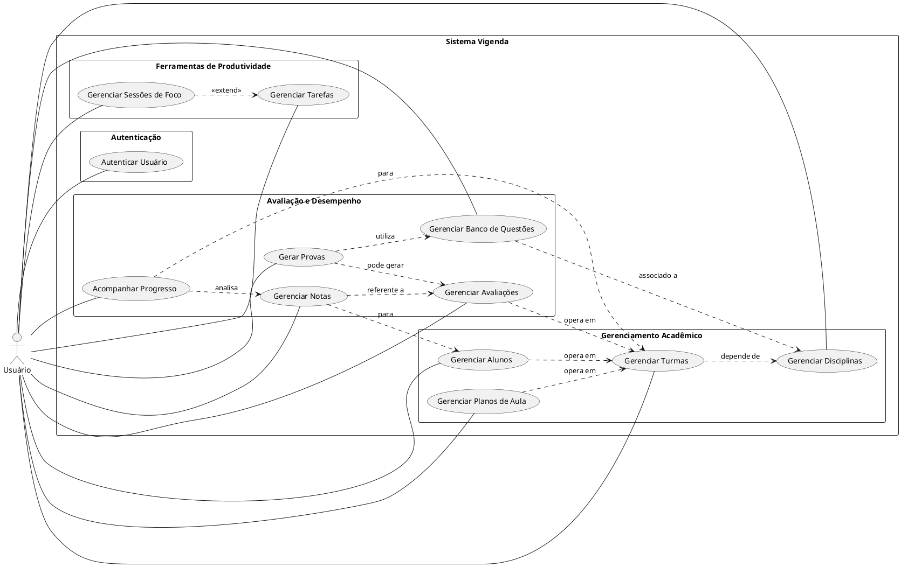

# Diagramas de Casos de Uso do Sistema Vigenda

Este diretório contém os diagramas de casos de uso para o sistema Vigenda, divididos em pacotes funcionais para melhor clareza e organização.

O ator principal em todos os diagramas é o **Usuário**.

## Diagramas Individuais

1.  **[Autenticação](./use_case_auth.puml)**
    *   Descreve os casos de uso relacionados ao processo de autenticação do usuário no sistema, como registro e login.
    *   [Visualizar `use_case_auth.puml`](./use_case_auth.puml)

2.  **[Gerenciamento Acadêmico](./use_case_academic_management.puml)**
    *   Detalha as funcionalidades centrais de gerenciamento de disciplinas, turmas, alunos e planos de aula.
    *   [Visualizar `use_case_academic_management.puml`](./use_case_academic_management.puml)

3.  **[Avaliação e Desempenho](./use_case_assessment_performance.puml)**
    *   Cobre os casos de uso relacionados à criação e gerenciamento de avaliações, banco de questões, geração de provas, lançamento de notas e acompanhamento do progresso dos alunos.
    *   [Visualizar `use_case_assessment_performance.puml`](./use_case_assessment_performance.puml)

4.  **[Ferramentas de Produtividade](./use_case_productivity_tools.puml)**
    *   Apresenta as funcionalidades voltadas para a produtividade do usuário, como gerenciamento de tarefas pessoais ou acadêmicas e sessões de foco.
    *   [Visualizar `use_case_productivity_tools.puml`](./use_case_productivity_tools.puml)

## Visão Geral Simplificada (Relação entre Pacotes)

Para entender como esses pacotes se conectam em um nível mais alto, considere o seguinte diagrama de visão geral simplificado. Ele omite os detalhes `<<include>>` e foca nas principais interações entre os grandes blocos funcionais.

**Como Visualizar os Diagramas `.puml`:**

Copie o conteúdo de qualquer arquivo `.puml` e cole-o em um renderizador PlantUML online, como:
*   [PlantUML Online Server](http://www.plantuml.com/plantuml)
*   Ou utilize uma extensão PlantUML no seu editor de código (ex: VS Code).

Estes diagramas fornecem uma visão estruturada das funcionalidades do sistema Vigenda sob a perspectiva do usuário.
